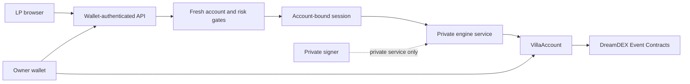

# VILLA

Liquidity infrastructure for DreamDEX Event Contracts.

VILLA is an LP-facing product for Somnia Shannon Event Contracts. It forms its
own fair value, applies deterministic risk rules, plans adaptive post-only
quotes, reconciles inventory and fills, recovers settled value, and follows
the next market window.

VILLA is for the liquidity provider, not the retail bettor. DreamDEX remains
the venue. Ordinary traders meet VILLA only as liquidity on the DreamDEX book.

**Public product:** [villa-ten-ashen.vercel.app](https://villa-ten-ashen.vercel.app/)
`/` is the public explainer, `/app` is the owner-scoped LP workspace, and
`/proof` is the read-only verified replay surface. Phase 2 owner-account
actions are proven on Shannon for the documented lifecycle. The autonomous
engine remains disconnected and safe-mode only. The local command is
`npm run dashboard:replay`.

**Legacy replay service:** [villa-yhzx.onrender.com](https://villa-yhzx.onrender.com)
remains available as a replay-only fallback; it is not the primary VILLA UI.

**Public repository:** [github.com/Techkeyy/villa](https://github.com/Techkeyy/villa)

**Demo video:** to be recorded by the operator after the rehearsal below.

**Network:** Somnia Shannon testnet, chain ID 50312.

[Hackathon](https://dorahacks.io/hackathon/event-contracts/detail) | [DreamDEX Event Contracts docs](https://docs.dreamdex.io/developers/event-contracts) | [DreamDEX bot kit](https://github.com/somnia-chain/dreamdex-bot-kit) | [License](LICENSE)

## The problem

Event Contract books need liquidity. A basic maker can place orders, but a
useful autonomous liquidity desk must answer more than "what is the last
midpoint?":

- What is the contract actually worth?
- How should inventory change the quote?
- When should quoting stop?
- What happens when an order fills?
- How does capital get claimed after settlement?
- Which market should receive the next bounded allocation?

The stock DreamDEX maker plumbing is valuable, but its fair price can be the
book midpoint, or `0.5` when the book is empty. That is useful execution
plumbing, not an independent view of the underlying market.

## What VILLA does

VILLA turns verified BTC and Event Contract data into a bounded operator
decision:

```text
BTC price feed + Event Contract reference
              |
              v
        villa-fv-v1
              |
              v
        villa-risk-v1
              |
              v
        villa-quote-v1
              |
              v
     bounded execution adapter
              |
              v
        DreamDEX binary CLOB

inventory -> fills -> settlement -> claim -> successor rollover

                 villa-dashboard-v1
                         |
                         v
                 LP workspace + proof
```

The fair-value core answers "what do we think UP is worth?" The Risk Governor
answers "are we allowed to take more risk?" Those are separate boundaries.
The public engine is read-only and observational. The separate Phase 2
owner-account boundary is wallet-mediated and does not connect the engine.

## Why DreamDEX Event Contracts

DreamDEX supplies binary UP/DOWN markets with fixed expiry and on-chain
settlement. That creates a real liquidity-operator problem: quotes must be
independent, inventory-aware, time-aware, post-only safe, and able to survive
the full capital lifecycle. VILLA uses the official
`@somnia-chain/markets-sdk` Event Contract surface on Shannon, not the
spot-only HTTP path.

## Why VILLA is different from `ec-maker`

VILLA builds above the official bot kit rather than replacing it or wrapping it
with a dashboard. The differentiating layer is:

| Capability | VILLA contribution |
| --- | --- |
| Value | `villa-fv-v1` derives UP probability from underlying price, reference, time, and realized log-return volatility. The DreamDEX midpoint is comparison only. |
| Quality | Freshness, history coverage, spacing, stability, and extrapolation produce a separate data-quality assessment. Broken inputs refuse closed. |
| Risk | `villa-risk-v1` produces deterministic `ALLOW`, `REDUCE_ONLY`, or `HALT` decisions with named reasons. |
| Exposure | Worst-case stress includes every signed pending binary order delta. Opposing orders are not netted optimistically. |
| Quotes | `villa-quote-v1` adapts spread, inventory skew, size, collateral, expiry, confidence, and exact tick/lot/minimum rules. |
| Lifecycle | Bounded execution, fill reconciliation, complete-set inventory, explicit redemption, wallet hygiene, and same-series successor rollover. |
| UX | A public explainer, owner-scoped LP workspace, and separate proof surface explain the product without exposing the execution engine. |

## Verified on Shannon

These are bounded testnet proofs, not claims of profitability or production
readiness.

| Evidence | Result |
| --- | --- |
| Live Event Contract write path | A tiny post-only `BUY_YES` rested on chain and was cancelled exactly. |
| Complete-set inventory | Minimum mint, post-only `SELL_YES` rest, exact cancel, and `burnSet` passed with a clean final state. |
| Two-sided liquidity | A bounded quote checkpoint rested and reconciled both post-only sides. |
| Organic fills | Two genuine external `SELL_YES` fills were recovered under their exact market IDs. |
| Settlement | Winning residuals were redeemed through the SDK and payout amounts reconciled. Known zero-value losing residuals remained labelled, not hidden. |
| Rollover | A terminal BTC window was closed and a later same-series successor was rediscovered without mixing market scope. |
| Wallet hygiene | Final audit ended with zero active orders and zero unknown inventory. |
| Phase 2 LP account | Real owner-browser Shannon proof completed: account deployment, exact 1 tUSDC approval and deposit, authorization, revocation, and owner-only withdrawal. |
| Historical local audit | Phase 2 final gate: 470 full tests, 87 dashboard tests, 17 operator tests, dashboard build, and zero production dependency vulnerabilities passed. |

Detailed evidence, hashes, conditions, and limitations are in
[`docs/TECHNICAL_VERIFICATION.md`](docs/TECHNICAL_VERIFICATION.md),
[`docs/FINAL_AUDIT.md`](docs/FINAL_AUDIT.md), and
[`docs/BACKEND_FREEZE.md`](docs/BACKEND_FREEZE.md). The complete Phase 2
owner-browser record is [`docs/PHASE_2_LP_ONBOARDING_PROOF.md`](docs/PHASE_2_LP_ONBOARDING_PROOF.md).

## Account-bound control status

PROVEN NOW:

- Public wallet onboarding on Somnia Shannon.
- One personal owner-controlled VILLA account.
- Exact tUSDC deposits.
- Scoped VILLA authorization and owner revocation.
- Owner-only withdrawal with no arbitrary destination.
- Historical VILLA market-making engine evidence.

PREPARED SAFELY, NOT PUBLICLY ARMED:

- An authenticated account-control seam that binds the caller to the account owner.
- A Start gate that consumes fresh owner, account, market, capital, risk, lease,
  and reconciliation facts before the existing account-bound session controller.
- A Stop path that delegates only scoped order cleanup, paired cleanup where safe,
  reconciliation, and lease release. It has no withdrawal or arbitrary relay path.
- Public Start, Pause, Stop, and DreamDEX order placement remain disabled until a
  real account-bound wet proof is completed and separately authorized.

The current 1-hour fallback is a read-only feasibility candidate only. A Shannon
checkpoint verified `BINARY:BTC:3600`, Trading status, the live pool grid and
binary outcome pair, 1.002 tUSDC capital, Risk `ALLOW`, and the projected
`mint -> SELL_YES -> cancel -> burn` path. No owner transaction, order, or
blockchain write was sent. The account-specific `prepareMarket` mapping remains
unavailable until its owner transaction is completed.

## Run the product surfaces

Requires Node.js 20 or newer.

```bash
npm install
npm run dashboard:replay
```

Open [http://127.0.0.1:4173](http://127.0.0.1:4173). The routes are:

- `/`: public product explainer.
- `/app`: LP workspace with owner-scoped account creation, exact tUSDC funding, authorization, revocation, and owner-only withdrawal. The LP journey and safe control-plane boundary are visible; Start VILLA remains disabled.
- `/proof`: read-only replay evidence for the three labelled scenes:

  - Quote proof: recorded two-sided post-only liquidity.
  - Rollover proof: terminal market, successor discovery, and an honest `NO QUOTE`.
  - Settlement proof: organic fills, redemptions, payout reconciliation, and wallet hygiene.

Replay is built from verified facts and does not send transactions. It does not
pretend that recorded events are happening live. The LP workspace never requests
a private key; its account actions use the connected wallet and exact on-chain
verification. Autonomous execution remains unavailable from the public frontend.

## Read-only live mode

To run the server-side Shannon adapter locally, provide the required names in a
gitignored `.env` and run:

```bash
npm run dashboard:live
```

The browser receives no environment variables, signer, private key, or writer
queue. If the live adapter cannot read a safe snapshot, the UI shows a `LIVE`
and `READ ONLY` error and does not silently fall back to replay.

Other read-only commands:

```bash
npm run doctor
npm run fair-value
npm run risk
npm run quote
```

`npm start` is the hosted replay command. The deployment configuration uses
only `HOST=0.0.0.0`; it must never receive `OPERATOR_PRIVATE_KEY` or any other
signing material. See [`docs/DEPLOYMENT.md`](docs/DEPLOYMENT.md).

## Verify the project

```bash
npm test
npm run dashboard:test
npm run dashboard:build
```

The dashboard build checks the static assets, clean route markers, and honest
development-preview copy. The current test and audit results should be read
from the command output for the checked commit.

Write-capable scripts exist only for bounded local testnet verification and
require explicit confirmation where applicable. Do not run them casually or
on a wallet that holds real value:

```bash
npm run verify:write:dry
npm run verify:inventory:dry
npm run verify:quote-cycle:dry
npm run verify:settlement:dry
npm run verify:rollover
npm run villa:bounded:dry
```

Wet write, mint, fill, redeem, and autonomous-run verification is not part of
normal dashboard use. No new transaction is required for the replay surface.

## Honest limitations

- This is a bounded Somnia Shannon testnet proof, not an indefinite production daemon.
- Complete realized maker PnL and all cash-flow components are unavailable; the UI says `PNL_UNAVAILABLE`.
- Restart recovery is bounded and explicit.
- The account-bound autonomous wet cycle is not yet proven for the current public product. The Phase 2 choice is `PER_USER_VILLA_ACCOUNT_REQUIRED`; the documented single-owner account lifecycle is proven on Shannon.
- Organic fills are market-dependent and are not manufactured for a demo.
- The zero-drift fair-value baseline is a correctness-first model, not a claim of predictive edge.
- Hosted execution remains signer-free and Start VILLA is disabled. Live read-only mode may be unavailable when public RPC/indexer access is not safe or reliable. Account setup is non-custodial and wallet-mediated, but is not a production execution claim.

## How I tried to break it

| Adversarial case | Behavior |
| --- | --- |
| Missing, invalid, stale, future, or non-monotonic price | Refuses or halts with a structured reason; never returns neutral `0.5` as an error sentinel. |
| Missing, zero, ambiguous, or unsupported reference scaling | Refuses closed. Explicit strike and opening-price fallback are resolved separately. |
| Gapped or insufficient volatility history | Refuses fair value or lowers data quality according to the documented boundary. |
| Expired or non-Trading market | Refuses new risk and distinguishes terminal lifecycle state. |
| Large inventory or pending orders | Stresses signed order deltas and enters `REDUCE_ONLY` or `HALT` as configured. |
| Post-only crossing or venue minimum failure | Clips or refuses the affected side; it does not cross the book. |
| Indexer and chain disagreement | Reconciles with chain authority and fails closed on unknown state. |
| Missing PnL accounting | Exposes `PNL_UNAVAILABLE`; no zero-profit fiction is created. |
| Live dashboard failure | Shows an explicit live read error; it does not substitute replay content. |

## Architecture and trust boundary

The intended production flow is account-bound and staged behind the same fresh
preflight facts that already protect the local controller:



The public browser never receives `K`. The public deployment is currently
read-only and the account-control seam is present for integration tests, not
for public wet execution.

| Layer | Job |
| --- | --- |
| SDK and read adapters | Discover `marketId`, on-chain status, reference, price feed, book, balances, and chain time. |
| Fair value | Pure `villa-fv-v1` calculation with no RPC, wallet, book, or environment dependency. |
| Governor | Pure `villa-risk-v1` safety policy with exposure and pending-order stress. |
| Quote planner | Pure `villa-quote-v1` value-centred adaptive quote planning. |
| Execution | Bounded, serialized, post-only write adapter with reconciliation and cleanup. |
| Lifecycle | Inventory, settlement, claim recovery, wallet hygiene, and successor scope. |
| Control plane | Wallet-authenticated, owner-scoped Start/Stop seam with explicit public and execution gates. |
| Dashboard | Read-only server adapter, replay envelope, LP product surfaces, and proof view. |

The existing operator EOA is the custody boundary for the historical local
testnet proofs only. The public experience is not a wallet and cannot write to
DreamDEX. Each LP account remains the capital boundary; the owner controls
deposits, authorization, and withdrawals, while any future engine action must
remain scoped to that account and its tracked market orders.

## Hackathon fit

| DoraHacks criterion | VILLA evidence |
| --- | --- |
| Technical Implementation, 25% | Real DreamDEX Event Contract SDK integration on Shannon, verified post-only writes, inventory, settlement, and reconciliation. |
| Innovation and Originality, 20% | Independent underlying-based value, deterministic governor, pending exposure, lifecycle recycling, and operator workflow above `ec-maker`. |
| User Experience and Design, 20% | White and blue explainer, LP workspace, and separate proof route with replay/live honesty and responsive UI. |
| Business and Ecosystem Impact, 20% | Software for the liquidity operator that can help keep Event Contract books usable for ordinary DreamDEX traders. |
| Presentation and Demo, 15% | Stable replay of real quote, fill, rollover, and settlement evidence, with a prepared 2 to 3 minute script. |

The current DoraHacks page displays a deadline of 2026/09/08 19:00 in the
Africa/Lagos browser session but does not state a timezone. This is recorded as
`TIMEZONE_NOT_EXPLICIT`; UTC is not guessed. See [`docs/HACKATHON.md`](docs/HACKATHON.md).

## SDK and documentation feedback

The useful feedback from implementation is constructive:

- current SDK and older bot-kit examples can differ;
- live venue IDs move, so discovery should provide the active value;
- recycled pools require `marketId` identity;
- `strike = 0` requires a documented opening-price path;
- chain time matters for expiry, freshness, and local clock offsets;
- finalized losing token residuals need explicit classification;
- exact tick, lot, and minimum helpers would reduce repeated integration errors.

## Demo and submission preparation

- Demo rehearsal: [`docs/DEMO_SCRIPT.md`](docs/DEMO_SCRIPT.md)
- Submission copy: [`docs/SUBMISSION.md`](docs/SUBMISSION.md)
- Finish-day status: [`docs/FINISH_DAY_STATUS.md`](docs/FINISH_DAY_STATUS.md)
- Deployment/security boundary: [`docs/DEPLOYMENT.md`](docs/DEPLOYMENT.md)
- Skills checkpoint: [`docs/SKILLS_COMPLIANCE.md`](docs/SKILLS_COMPLIANCE.md)

The public repository and deployed VILLA frontend are published for inspection.
The owner-scoped account actions remain wallet-mediated testnet functionality;
the execution engine is not connected. The final video is not recorded or
uploaded automatically, and DoraHacks submission is not performed by this
repository workflow.

## Project records

- [`docs/PROJECT_UNDERSTANDING.md`](docs/PROJECT_UNDERSTANDING.md)
- [`docs/ARCHITECTURE_NOTES.md`](docs/ARCHITECTURE_NOTES.md)
- [`docs/DECISIONS.md`](docs/DECISIONS.md)
- [`docs/BUILD_PLAN.md`](docs/BUILD_PLAN.md)
- [`docs/FAIR_VALUE_MODEL.md`](docs/FAIR_VALUE_MODEL.md)
- [`docs/RISK_GOVERNOR.md`](docs/RISK_GOVERNOR.md)
- [`docs/QUOTE_PLANNER.md`](docs/QUOTE_PLANNER.md)
- [`docs/AUTONOMOUS_LOOP.md`](docs/AUTONOMOUS_LOOP.md)
- [`docs/FINAL_AUDIT.md`](docs/FINAL_AUDIT.md)
- [`docs/PHASE_2_LP_ONBOARDING.md`](docs/PHASE_2_LP_ONBOARDING.md)
- [`docs/LP_ACCOUNT_DISCOVERY.md`](docs/LP_ACCOUNT_DISCOVERY.md)
- [`docs/PHASE_2_SECURITY_AUDIT.md`](docs/PHASE_2_SECURITY_AUDIT.md)
